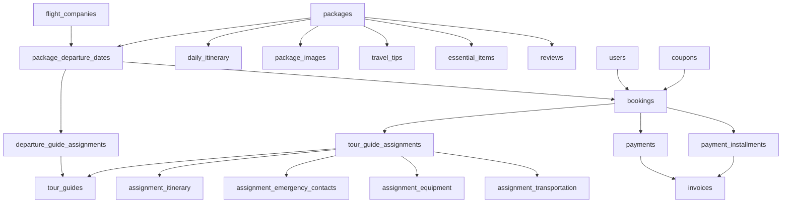

# 📊 COMPLETE DATABASE TABLES - TMPL ESCAPADE
**Version 3.0 - Production Ready**  
**Total Tables: 23**  
**Date: November 1, 2025**

---

## ✅ ALL BUSINESS RULES IMPLEMENTED

| # | Rule | Implementation |
|---|------|----------------|
| **#1** | Booking must select departure date | `bookings.departure_date_id` NOT NULL |
| **#2** | Auto-assign tour guides | Database trigger on booking insert |
| **#3** | Prevent guide overlaps | Trigger function checks date conflicts |
| **#4** | Invoice cumulative tracking | Fields: `previous_total_paid`, `cumulative_total_paid` |
| **#5** | One primary destination | Package fields: continent, country, region |
| **#6** | Review packages only | UNIQUE(package_id, customer_id) |
| **#7** | Flexible coupon application | `coupon_applied_at` ('booking' or 'payment') |
| **#8** | Corporate booking fields | Added to bookings table |
| **#9** | Package-level itinerary | `daily_itinerary.package_id` FK |
| **#10** | One flight per departure | `package_departure_dates.flight_company_id` FK |

---

## 📋 COMPLETE TABLE LIST (23 TABLES)

### **CORE ENTITIES (5)**

1. **`users`** - System users (customers + staff)
   - Roles: super_admin, admin, booking_reservation, tour_guide, travel_agent, finance, sales_marketing, customer
   - Customer tiers: normal, vip, vvip

2. **`packages`** - Travel packages
   - One primary destination (Rule #5)
   - Difficulty levels, pricing, group sizes
   - Performance metrics

3. **`flight_companies`** - Flight providers (Rule #10)
   - Assigned to departure dates

4. **`tour_guides`** - Unified guide entity
   - Handles both pre-booking and execution
   - License tracking, certifications

5. **`destinations`** - Destination management
   - Country, continent, visa info
   - Timezone, currency, language

---

### **PACKAGE DETAILS (5)**

6. **`daily_itinerary`** - Day-by-day schedule (Rule #9)
   - Package level only
   - Activities, meals, accommodation

7. **`package_images`** - Photo gallery
   - Hero images and gallery

8. **`travel_tips`** - Travel advice
   - Categories: Health, Safety, Cultural, Packing

9. **`essential_items`** - Packing list
   - Mandatory vs optional items

10. **`package_departure_dates`** - Multiple departure dates (Rule #1)
    - Each with capacity, pricing, flight assignment
    - Status: active, full, cancelled

---

### **TOUR GUIDE ASSIGNMENTS (6)**

11. **`departure_guide_assignments`** - Pre-booking planning (Rule #2, #3)
    - Assigns guides to departure dates
    - Conflict prevention trigger

12. **`tour_guide_assignments`** - Post-booking execution (Rule #2)
    - Auto-inherited from departure assignments
    - Status: upcoming, in_progress, completed

13. **`assignment_itinerary`** - Daily execution plan
    - Specific dates and activities per assignment

14. **`assignment_emergency_contacts`** - Emergency info
    - Names, phones, relationships

15. **`assignment_equipment`** - Equipment tracking
    - Status: needed, acquired, returned

16. **`assignment_transportation`** - Transport details
    - Pickup/dropoff times and locations

---

### **BOOKING & PAYMENTS (6)**

17. **`bookings`** - Customer bookings (Rules #1, #7, #8)
    - REQUIRED departure_date_id
    - Corporate booking fields
    - Coupon application tracking

18. **`coupons`** - Discount codes (Rule #7)
    - Flexible application (booking or payment time)
    - Usage limits, restrictions

19. **`payments`** - Payment transactions
    - Methods, references, status

20. **`payment_installments`** - Installment plans
    - Frequency, due dates, reminders

21. **`invoices`** - E-invoice generation (Rule #4)
    - Cumulative payment tracking
    - Previous paid + current + remaining balance

22. **`reviews`** - Package reviews (Rule #6)
    - Only package reviews (not booking-specific)
    - One review per customer per package

---

## 🔗 KEY RELATIONSHIPS

---

## 🎯 CRITICAL DATABASE FEATURES

### **Automatic Triggers**
1. ✅ Auto-inherit tour guides when booking created (Rule #2)
2. ✅ Prevent overlapping tour guide assignments (Rule #3)
3. ✅ Update departure date capacity on booking
4. ✅ Update booking paid_amount on payment
5. ✅ Calculate available spots automatically

### **Data Integrity**
- ✅ Foreign key constraints on all relationships
- ✅ Check constraints on enums and amounts
- ✅ Unique constraints prevent duplicates
- ✅ NOT NULL on critical fields

### **Performance Optimizations**
- ✅ Indexes on all foreign keys
- ✅ Indexes on frequently queried fields (status, dates, emails)
- ✅ Generated columns for calculated values

---

## 📦 FINAL DELIVERABLES

| File | Description |
|------|-------------|
| `DATABASE_SCHEMA_FINAL.sql` | Complete SQL schema with all 23 tables |
| `DATABASE_ENHANCEMENTS_SUMMARY.md` | Business rules and discoveries |
| `COMPLETE_TABLE_LIST.md` | This document - table reference |

---

## ✅ PRODUCTION READINESS CHECKLIST

- [x] All 10 business rules implemented
- [x] 23 tables defined with proper constraints
- [x] Database triggers for automation
- [x] Conflict prevention mechanisms
- [x] Indexes for performance
- [x] Referential integrity
- [x] Data validation
- [x] Audit timestamps (created_at, updated_at)
- [x] Soft delete capabilities (status fields)
- [x] Scalability considerations (UUIDs, JSONB for flexibility)

---

## 🚀 READY FOR MIGRATION!

This architecture is **production-ready** and fully aligned with your admin panel requirements! 

**Next Step:** Deploy to Supabase PostgreSQL 🎉
